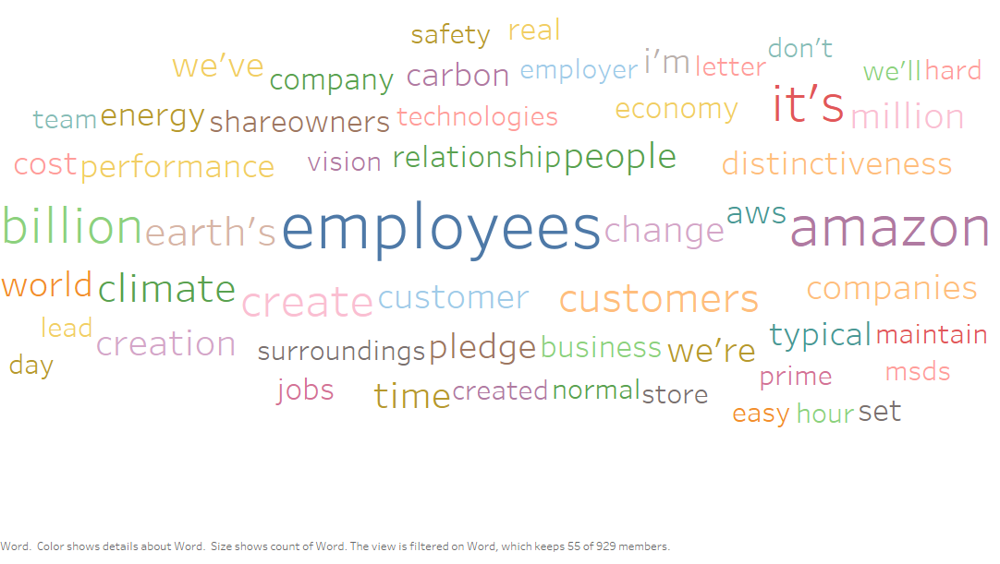
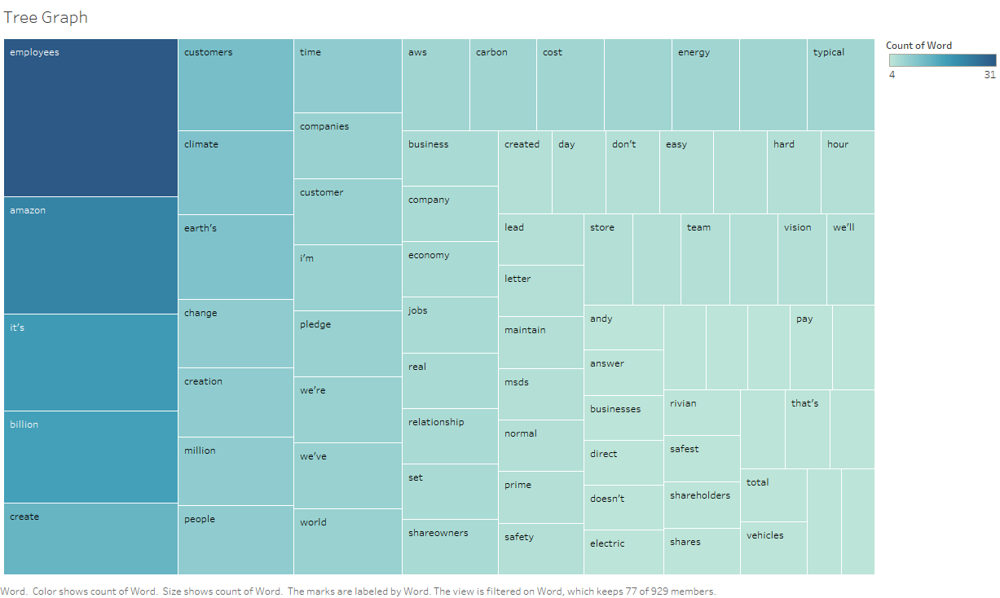
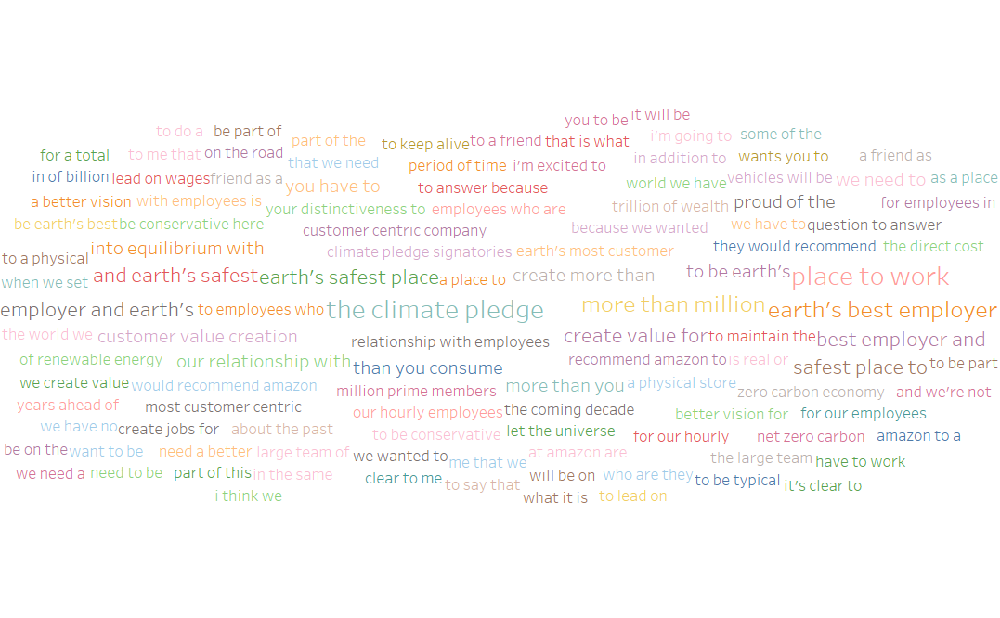

```{r}
library(readr)
library(tidytext)
library(dplyr)
library(tm)
library(ngram)
```

```{r}
get_sentiments("bing")
get_sentiments("afinn")
get_sentiments("nrc")
get_sentiments("loughran")
```


With this text document, do the following:

```{r}
##Enter File Name
doc <- read_file("amazon.txt")
```


1. First, clean the text document from breaks (\r\n) and numbers
```{r}
## A couple lines to clean up the docs and remove the numbers
doc <- gsub("\r\n", " ", doc)
doc <- removeNumbers(doc)
```


2. Tokenize the document and then remove the stop words
```{r}
##This breaks the text down word by word aka Tokenizes them
tokens <- data_frame(text = doc) %>% unnest_tokens(word, text)

##This removes all of the Stop Words from our tokens
cleanTokens <- tokens[!tokens$word %in% stop_words$word,]
```


3. With the stop words cleared, export the data into a .csv and open it up in Tableau
```{r}
##Use this function to Export your file as a csv to use in Tableau or other
write.csv(cleanTokens,"tokens.csv", row.names = FALSE)
```

4. Within Tableau create at least two graphics to summarize this data. It could be a bar chart, word cloud, bubble cloud, tree graph, ect. Submit those two graphs. It might be helpful to set up a filter to leave out the less used words. (A filter of 3 worked well for me)





5. Within R, use at least two of the lexicons (bing, afinn, nrc, or loughran) to analyze the sentiment. Include a table of the results and comment on the overall sentiment

```{r}
##This will give us the sentiment from the Bing lexicon
sentiment <- cleanTokens %>%
  inner_join(get_sentiments("bing"))
table(sentiment$sentiment)
```

```{r}
##This will give us the sentiment distribution from the Afinn lexicon
sentiment <- cleanTokens %>%
  inner_join(get_sentiments("afinn"))
table(sentiment$value)
hist(sentiment$value)
```

```{r}
##This will give us the sentiment from the NRC lexicon
sentiment <- cleanTokens %>%
  inner_join(get_sentiments("nrc"))
table(sentiment$sentiment)
counts <- table(sentiment$sentiment)
barplot(counts,main = "NRC Sentiments",ylab = "Number",xlab ="Emotion")
```

```{r}
##This will give us the sentiment from the Loughran Lexicon
sentiment <- cleanTokens %>%
  inner_join(get_sentiments("loughran"))
table(sentiment$sentiment)
counts <- table(sentiment$sentiment)
barplot(counts,main = "Loughran Sentiments",ylab = "Number",xlab ="Financial Context")
```


6. Within R, use the ngram function to create word grams of size 3. You can play around with the babble function at this point to see if you can create any interesting phrases. Babble of length 20 or so gives some amusing results. Export the 3-gram and create a word cloud in R with data. Again, setting up a filter works well (greater than or equal to 2 worked nice). 

```{r}
## We can play with multiple word sequences. Use this to create the n-gram where n is the
#number of words in the string
text <- concatenate(tokens$word)
ng <- ngram(text,3)

##This is the frequencies for the given n-gram
gram <- get.phrasetable(ng)
head(gram,10)

##some nonsense we can play around with
babble(ng,100)

## This will export the n-grams as a csv
write.csv(gram,"grams.csv", row.names = FALSE)
```

[1] "that it would be good to address climate change but they also thought it would cost a lot and would threaten jobs competitiveness and economic growth we now know better smart action on climate change will not only stop bad things from happening it will also make our economy more efficient help drive technological change and reduce risks combined these can lead to more and better jobs healthier and happier children more productive workers and a more prosperous future this doesn’t mean it will be satisfying and oftentimes fun thank you andy to all of you be kind be original "



The overall sentiment of this article was positive. All of the analyses came out with a generally positive outlook.