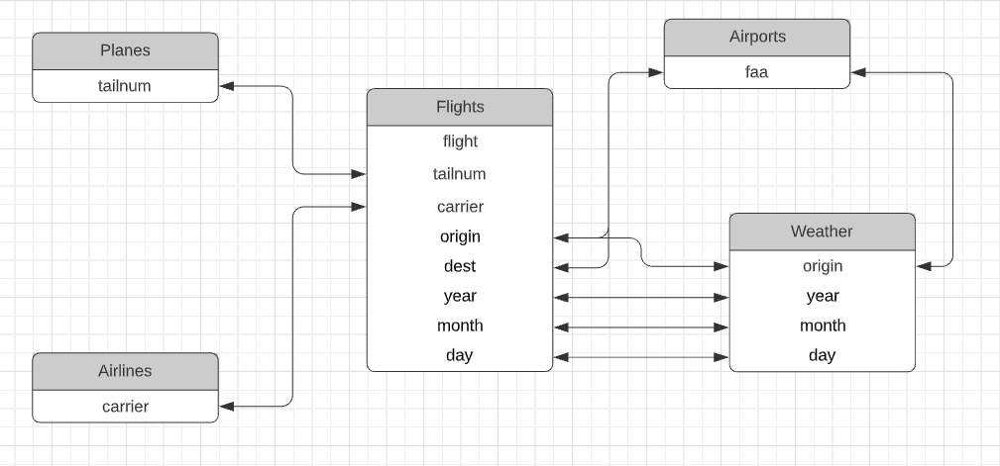

COSC 322 Data Visualization
Mid-Term Exam  150 pts
Take-Home Exam

“On my honor, I pledge that I have upheld the Honor Code, and that the work I have done on this assignment has been honest, and that the work of others in this class has, to the best of my knowledge, been honest as well.”

Name: T.J. Liggett

Find a quiet place to work this exam individually during the next few days.  You will turn in your exams as an R Notebook HTML file (AND and your RMD source file).  Copy/Paste the questions below into that document and build your code and graphics around it.  Submit your HTML code by the due date & time (March 18 @ 11:59pm).  For all questions where the answer was computed, give the answer and the R code needed to compute the answer.  You must use the tidyverse approach with pipes whenever you can.  Find the most compact solution.  If you take a roundabout approach (and avoid the tidyverse), points will be deducted.  If a plot is called for, use ggplot2 unless another package is requested.  Layout, neatness, and visual appeal counts!  Your “destination” will be provided via a note to you for this “assignment” in Classroom.  Your origin in NYC is from any of the NYC-area 3 airports (origins) listed in the dataset.  Proper use of Notebooks, Rmarkdown, and HTML generation is worth 25 pts.

1.  (10) This exam works with the nycflights13 dataset we used in class.  It is contained in the package of the same name.  It consists of five datasets (tibbles):

flights
airlines
airports
planes
weather

```{r}
library(nycflights13)
library(tidyverse)
library(ggplot2)
library(lubridate)
library(leaflet)
```


These datasets are linked by common variables called keys.  Find the variables that are common and construct a diagram that draws links between the fields.  Put the flights dataset in the middle of your diagram.  (You may do this manually with a drawing tool).  This diagram will come in handy when you need to link data in the various tables to answer the questions that follow.  (There is an example in your text.  Do NOT copy that one!)





2. (5) Your flight destination is assigned by me and given via a message in Classroom.  How many flights were made to your destination airport in 2013? 

```{r}

# Find the Tampa Intl. faa
tampa_intl <- airports %>%
  filter(name %in% c("Tampa Intl"))
faa_tampa <- tampa_intl$faa

# filter flights to Tampa
tampa_flights <- flights %>%
  filter(dest %in% c(faa_tampa), year %in% c(2013))

tampa_flights  %>%
  summarise(count = n())

# NOTE: It appears there are ONLY 2013 flights to TPA, so the second filter isn't necessary...
```
There were 7466 flights to Tampa Intl in 2013.


3. (10) How many flights per month were made to your destination?  Per week?   Day of week?  Show me summarized data and a plot for each.

```{r}
# Flights per month to Tampa Intl

monthly <- tampa_flights %>%
  group_by(month) %>%
  summarise(count = n())

# summarized data
monthly

# plot
ggplot(data = monthly, mapping = aes(x = month, y = count)) +
  geom_line(color = "#D50A0A") +
  scale_x_continuous(breaks =  c(1,2,3,4,5,6,7,8,9,10,11,12), limits = c(1,12)) +
  labs(title = "Flights Per Month to Tampa Intl", x = "month", y="Number of Flights") +
  theme_bw()
```

```{r}
# Flights per week to Tampa Intl
tampa_flights$week <- week(tampa_flights$time_hour)

weekly <- tampa_flights %>%
  group_by(week) %>%
  summarise(count = n())

# summarized data
weekly

# plot
ggplot(data = weekly, mapping = aes(x = week, y = count)) +
  geom_line(color = "#D50A0A") +
  scale_x_continuous(breaks =  c(1,5,9,13,17,21,25,29,33,37,41,45,49,53), limits = c(1,53)) +
  labs(title = "Flights Per Week to Tampa Intl", x = "month", y="Number of Flights") +
  theme_bw()
```

The 53rd week takes a dip because there are less days in it.

```{r}
# Flights per day of week to Tampa Intl
tampa_flights$dow <- wday(tampa_flights$time_hour)

dayofweek <- tampa_flights %>%
  group_by(dow) %>%
  summarise(count = n())

# summarized data
dayofweek

# plot
ggplot(data = dayofweek, mapping = aes(x = dow, y = count)) +
  geom_line(color = "#D50A0A") +
  scale_x_continuous(breaks =  c(1,2,3,4,5,6,7), limits = c(1,7)) +
  labs(title = "Flights Per Day of the Week to Tampa Intl", x = "Day of the Week", y="Number of Flights") +
  theme_bw()
```

4. (10) Which airlines made the most flights to your destination city?   Show me numerically (ordered most to least) and graphically.

```{r}

tampa_airlines <- tampa_flights %>%
  group_by(carrier) %>%
  summarise(count = n()) %>%
  arrange(desc(count))

# summarized data
tampa_airlines

# plot
ggplot(data = tampa_airlines) +
  geom_bar(stat = "identity", mapping = aes(x=reorder(carrier,-count), y = count, fill=count)) +
  scale_fill_gradient(low="#FF7900", high="#D50A0A") +
  labs(title = "Tampa Intl. Flights by Carrier", x = "Carrier", y="Number of Flights") +
  theme_bw() +
  theme(legend.position = "none")
  
  
```

5.  (10) What make & model of aircraft (type of plane) were used by the top two carriers to your destination?  Show the data both as-is and aggregated to type of aircraft (for example, all 737 models grouped, 757’s etc.)

```{r}
# take make and models
m_and_m <- planes %>%
  select(tailnum, manufacturer, model)

# limit to top 2 tampa carriers
two_carriers <- tampa_airlines %>%
  top_n(2)

# find planes used by two carriers
two_carriers_planes <- flights %>%
  filter(carrier %in% two_carriers$carrier) %>%
  select(carrier, tailnum) %>%
  distinct()

# filter for planes from top two carriers
vroom_planes <- planes %>%
  filter(tailnum %in% two_carriers_planes$tailnum)
  

# This is the data as-is, first tibble 809 x 9
vroom_planes 

# This is the data aggregated to type of aircraft
vroom_planes %>%
  group_by(manufacturer, model) %>%
  summarise(count = n()) %>%
  arrange(desc(count))

```
The first tibble with 809 planes is the as-is data, and the second tibble is aggregated by type of aircraft.


6.  (10) What was the frequency of use of a particular aircraft (identified by the plane tail number) to your destination during the year?  Show a list of the 10 aircraft that made the most trips.  Your list should be sorted with the most-used first and it should contain the following information:  Tail number, carrier, manufacturer, model, seats.

```{r}

# Pull the carriers and tailnums from flights data
plane_carriers <- flights %>%
  group_by(tailnum) %>%
  select(tailnum, carrier) %>%
  distinct(tailnum, .keep_all = TRUE)

# find the top ten planes
top_tampa_planes <- tampa_flights %>%
  group_by(tailnum) %>%
  summarise(count = n()) %>%
  arrange(desc(count)) %>%
  top_n(10) %>%
  left_join(planes, by="tailnum") %>%
  left_join(plane_carriers, by="tailnum") %>%
  select(tailnum, carrier, count, manufacturer, model, seats)

top_tampa_planes
```

I found it odd that there was no make/model for one of the planes, but then I found out it wasn't in the planes dataset...

```{r}
# So this plane N526JB doesn't exist in the planes dataset I swear

flights %>%
  filter(tailnum %in% c("N526JB"))

planes %>%
  filter(tailnum %in% c("N526JB"))
```


7. (10) To what other destinations did these 10 aircraft fly?  Give me a summarized dataset with the number of times a particular destination was reached.  Show the data in a table and graphically.

```{r}
# filter for those planes
tampa_planes_flights <- flights %>%
  filter(tailnum %in% top_tampa_planes$tailnum)

# get counts of plane destinations
destination_counts <- tampa_planes_flights %>%
  group_by(dest) %>%
  summarise(count = n()) %>%
  arrange(desc(count))

# summarized dataset
destination_counts

# graphically
ggplot(data = destination_counts) +
  geom_bar(stat = "identity", mapping = aes(x=reorder(dest,-count), y = count, fill = count)) +
  scale_fill_gradient(low="#FF7900", high="#D50A0A") +
  labs(title = "Top Destinations of the Top 10 Tampa Aircrafts", x = "Destination", y="Number of Flights") +
  theme_bw() +
  theme(legend.position = "none",
        axis.text.x = element_text(face="bold", color="#34302B", 
                           size=10, angle=90, vjust = 0.4),
        )
```


8. (15) Using the data generated above, use Leaflet for R to plot the destinations of these 10 aircraft on a map.  Use a marker to indicate the destination airports, and a different color for the starting points.  The geographic location of the airports is included in our datasets.

```{r}
# pull coordiates for origins
origin_coord <- airports %>%
  select(origin = faa, origin_lat = lat, origin_lon = lon)

# pull coordinates for destinations
dest_coord <- airports %>%
  select(dest = faa, dest_lat = lat, dest_lon = lon)

# add origin and destination coordinates
tampa_planes_flights_geo <- tampa_planes_flights %>%
  left_join(origin_coord, by="origin") %>%
  left_join(dest_coord, by="dest")

# pull distinct origins
origin_geo <- tampa_planes_flights_geo %>%
  group_by(origin) %>%
  select(origin, lat = origin_lat, lon = origin_lon) %>%
  drop_na() %>%
  distinct()

# pull distinct destinations
dest_geo <- tampa_planes_flights_geo %>%
  group_by(dest) %>%
  select(dest, lat = dest_lat, lon = dest_lon) %>%
  drop_na() %>%
  distinct()
  
leaflet() %>%
  # setView(-96.737010, 43.522951, zoom = 16) %>% 
  addTiles() %>%
  addCircleMarkers(origin_geo$lon, origin_geo$lat) %>%
  addCircleMarkers(dest_geo$lon, dest_geo$lat, color = '#ff0000')
```


Another scary here... but SJU does not appear to be in the airports...
```{r}
airports %>%
  filter(faa == c('SJU'))
```

I have a hunch it is all of the Puerto Rico / non-US airports that are being excluded here

```{r}
tampa_flights_geo_safe <- tampa_planes_flights_geo %>%
  select(flight, dest, dest_lon, dest_lat) %>%
  drop_na()

tampa_planes_flights_geo %>%
  filter(!flight %in% tampa_flights_geo_safe$flight) %>%
  select(dest) %>%
  distinct()

```

Note that the three non-existent airports in the airports dataset are SJU, BQN, and PSE, all Puerto Rico airports.

9. (15) Again using Leaflet, use a filled circle, colored by the number of times a particular destination was reached with the two most-used aircraft.  Use blue fill for the 1st and red fill for the second.  Choose a scaling for the circle that best tells the story, and use transparent colors so both show up.

```{r}

# get the top two tampa planes
two_tampa_planes <- top_tampa_planes %>%
  top_n(2)


# get coordinates of two planes' flights
two_planes_geo <- tampa_planes_flights_geo %>%
  filter(tailnum %in% two_tampa_planes$tailnum) %>%
  group_by(tailnum, dest) %>%
  summarize(count = n()) %>%
  left_join(dest_coord, by="dest")

# generate color palette based on tail number
pal <- colorFactor(c("blue", "red"), domain = two_tampa_planes$tailnum)

leaflet(two_planes_geo) %>%
  addTiles() %>%
  addCircles(lng = ~dest_lon, lat = ~dest_lat, weight = 1,
    radius = ~sqrt(count)*10000 + 15000, popup = ~dest, color = ~pal(tailnum))
  #addCircleMarkers(dest_geo$lon, dest_geo$lat, color = '#ff0000')
```


10.  (30) Suppose I am looking to optimize my use of frequent-flyer programs and that I travel through NYC alot.  Using the top carriers to your destination, show me where else they fly (from NYC).  This question is more “open” than the others.  Show me the summarized data and show me a graphic (I like maps!) that illustrates the variety of destinations possible and that illustrates which two frequent-flyer programs (carriers) I should focus on.  Separate (differentiate between) the 3 NYC origin airports in this question.  Sell me on it!


```{r}
# Based on the graph above, there are 5 significant carriers for the Tampa Airport
top_5_carriers <- tampa_airlines %>%
  top_n(5)


top_carrier_flights <- flights %>%
  filter(carrier %in% top_5_carriers$carrier) %>%
  left_join(airlines, by="carrier")

  
top_carrier_destinations <- top_carrier_flights %>%
  group_by(carrier, origin, dest) %>%
  summarise(count = n()) %>%
  left_join(dest_coord, by="dest") %>%
  drop_na()


flights %>%
  select(origin) %>%
  distinct()
```

The three NYC airports are EWR, LGA, and JFK

```{r}
lga_flights <- top_carrier_flights %>%
  filter(origin %in% c("LGA")) %>%
  group_by(carrier) %>%
  summarize(count = n()) %>%
  arrange(desc(count))
  
ewr_flights <- top_carrier_flights %>%
  filter(origin %in% c("EWR")) %>%
  group_by(carrier) %>%
  summarize(count = n()) %>%
  arrange(desc(count))

jfk_flights <- top_carrier_flights %>%
  filter(origin %in% c("JFK")) %>%
  group_by(carrier) %>%
  summarize(count = n()) %>%
  arrange(desc(count))

ggplot(data = lga_flights) +
  geom_bar(stat = "identity", mapping = aes(x=reorder(carrier,-count), y = count, fill = count)) +
  scale_fill_gradient(low="#FF7900", high="#D50A0A") +
  labs(title = "Flights out of LGA by Carrier", x = "Carrier", y="Number of Flights") +
  theme_bw() +
  theme(legend.position = "none")

ggplot(data = ewr_flights) +
  geom_bar(stat = "identity", mapping = aes(x=reorder(carrier,-count), y = count, fill = count)) +
  scale_fill_gradient(low="#FF7900", high="#D50A0A") +
  labs(title = "Flights out of EWR by Carrier", x = "Carrier", y="Number of Flights") +
  theme_bw() +
  theme(legend.position = "none")

ggplot(data = jfk_flights) +
  geom_bar(stat = "identity", mapping = aes(x=reorder(carrier,-count), y = count, fill = count)) +
  scale_fill_gradient(low="#FF7900", high="#D50A0A") +
  labs(title = "Flights out of JFK by Carrier", x = "Carrier", y="Number of Flights") +
  theme_bw() +
  theme(legend.position = "none")


```
It appears that DL flies the most total flights out of LGA (over 20000), with MQ and AA also flying over 15000.
UA flies by far the most out of EWR, and B6 out of JFK.


I would recommend going with either United (UA) or Delta (DL) for your frequent flyers program. Using the leaflet map with filters below, you can see that Delta offers a competitive amount of destinations from NYC to United, if you are willing to use multiple airports. Delta sends a ton of flights out of both LGA and JFK, while United sends almost all of their flights out of EWR.

Along with sending most of their flights from a specific airport, United also sends the most total flights out of NYC, making it my number one recommendation. You have the most flights with a lot of coverage of US locations, without the hassle of dealing with multiple airports.

While B6 sends the most flights to Tampa, and a competitive total number of flights to the other two, most of these flights are localized to NY/NE locations as well as Florida. You can enjoy a wider range of destinations with the other two.


```{r}
#install.packages("crosstalk")  
#install.packages("DT")
library(crosstalk)
library(crosstalk)
library(leaflet)
library(DT)

# color palette by destinations
pal <- colorFactor(c("blue", "red", "darkgreen", "orange", "purple"), domain = top_5_carriers$carrier)

# generate a leaflet visualization with filters

sd <- SharedData$new(top_carrier_destinations)

bscols(widths = c(3, NA),
  list(
    filter_checkbox("carrier", "Carrier", sd, ~carrier, inline = TRUE),
    filter_checkbox("origin", "Origin Airport", sd, ~origin, inline = TRUE)
  ),
  leaflet(sd) %>% addTiles() %>%
    setView(-98.58, 39.82, zoom = 3) %>% 
    addCircles(lng = ~dest_lon, lat = ~dest_lat, weight = 5,
    radius = ~sqrt(count)*1000 + 1000, popup = ~dest, color = ~pal(carrier)) 
)

```

